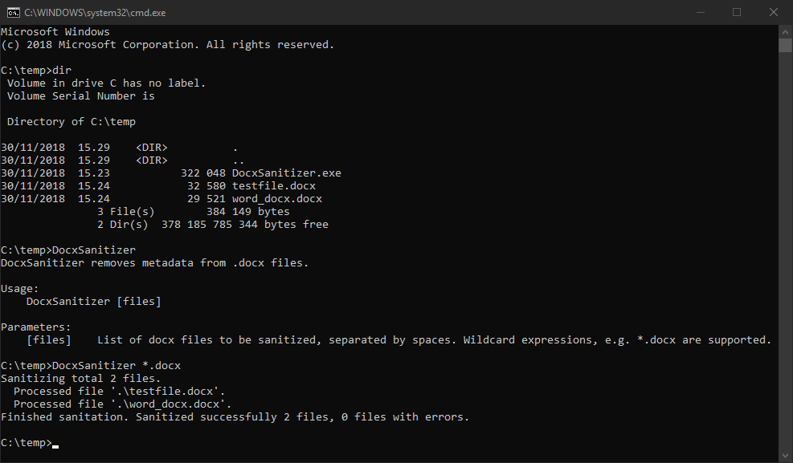

# Docx Sanitizer

Docx Sanitizer is a simple program for sanitizing metadata in .docx files. Currently it sanitizes following metadata:

* Core properties (docProps/core.xml), excluding *dcterms* namespace. Values are overwritten with blank values.

Docx Sanitizer requires .NET 4.6.1 and is built for Windows 7/8/10 with [Visual Studio Community](https://visualstudio.microsoft.com). It uses [DocX](https://github.com/xceedsoftware/DocX) library for handling .docx files.

## Usage

Docx Sanitizer is a command line program. It takes a list of .docx files as parameters.

**WARNING:** Docx Sanitizer overwrites existing files with sanitized versions! Always make a backup of the files before using Docx Sanitizer!

## Disclaimer

Docx Sanitizer is a work in progress. Use it at your own risk. See [license](LICENSE.txt) for more details.
